# 📰 Newss_App

Newss là ứng dụng cập nhật tin tức được phát triển bằng Flutter, giúp người dùng dễ dàng theo dõi các bài viết mới nhất theo nhiều chủ đề khác nhau như công nghệ, thể thao, giáo dục, kinh tế và du lịch.

## 🎬 Demo

👉 [Video Demo](https://drive.google.com/drive/folders/177yKcX6GFxVLNSvL7BnklGrlpVgMoA1B?usp=sharing)

## ✨ Các tính năng chính

### 👤 Người dùng

- Đăng ký / Đăng nhập
- Đăng nhập bằng Google
- Xem bài viết theo chủ đề
- Tìm kiếm bài viết
- Tóm tắt bài viết bằng AI
- Lưu bài viết yêu thích
- Chia sẻ bài viết
- Gợi ý bài báo liên quan
- Thông báo bài báo mới
- Tài khoản & quản lý người dùng

### 🛠️ Admin

- Dashboard thống kê
- Quản lý danh mục
- Quản lý bài viết
- Quản lý người dùng

---

## 🖼️ Giao diện sản phẩm

<p align="center">
  Nhóm chức năng đăng nhập/đăng ký/quên mật khẩu
</p>

<div align="center">
  <table>
    <tr>
      <td>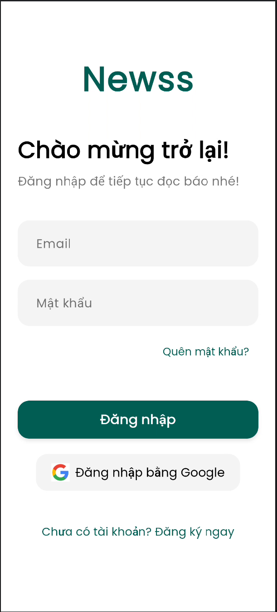</td>
      <td>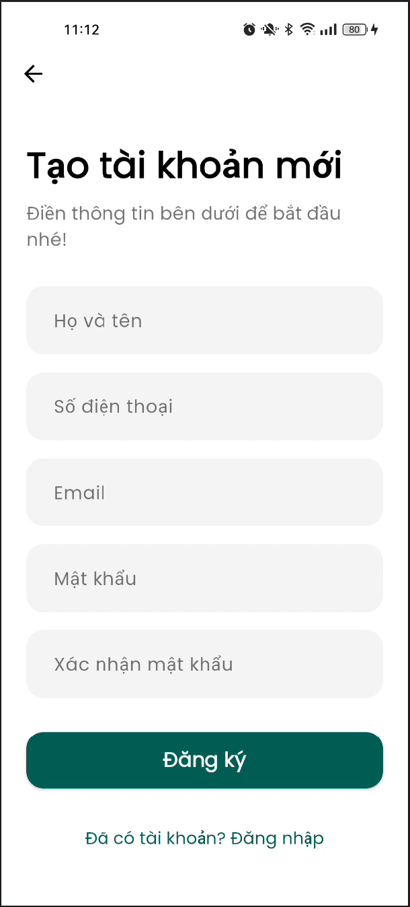</td>
      <td>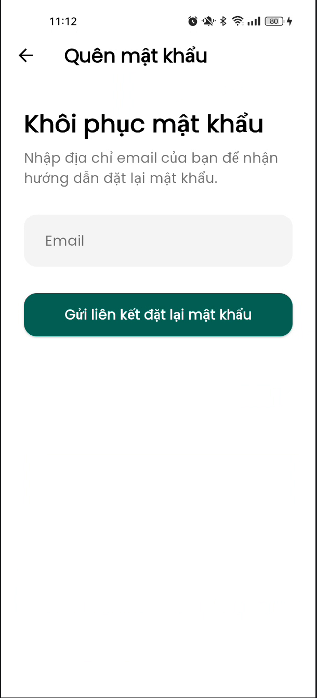</td>
      <td></td>
    </tr>
  </table>
</div>

<p align="center">
  Nhóm chức năng người dùng
</p>

<div align="center">
  <table>
    <tr>
      <td>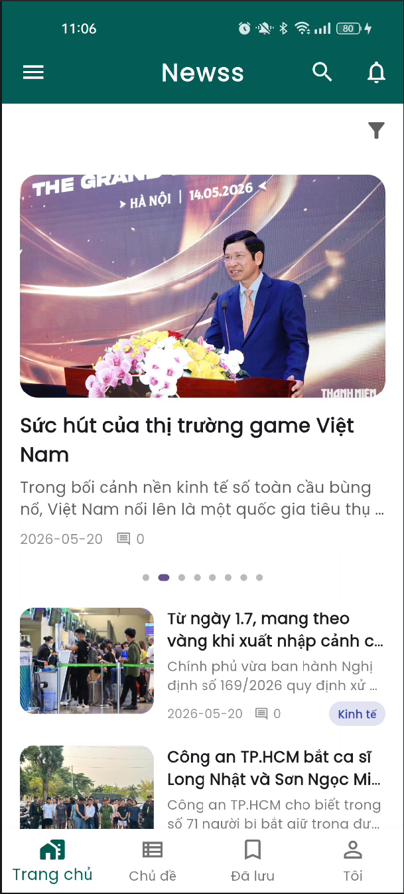</td>
      <td>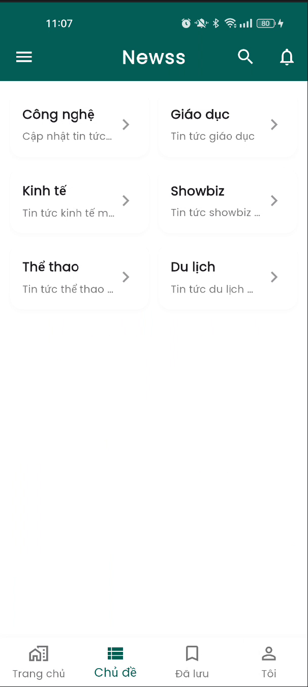</td>
      <td>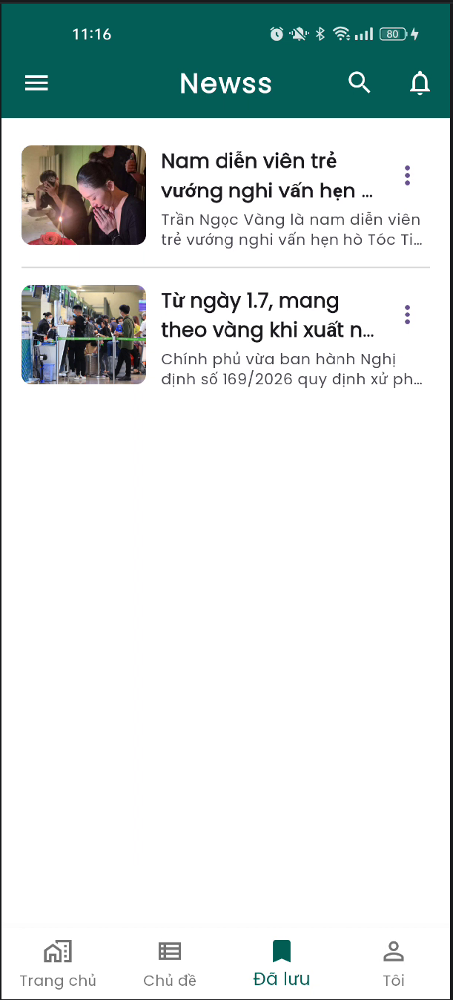</td>
      <td></td>
    </tr>
    <tr>
      <td></td>
      <td>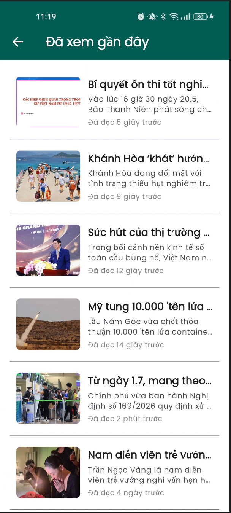</td>
      <td></td>
      <td>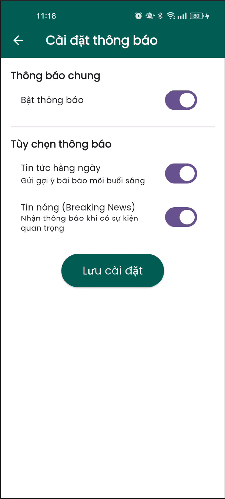</td>
    </tr>
    <tr>
      <td></td>
      <td>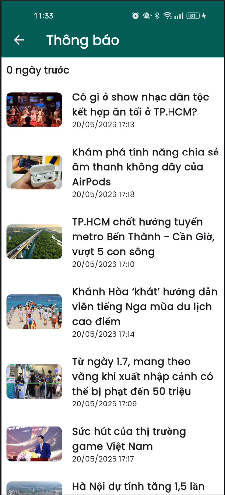</td>
      <td>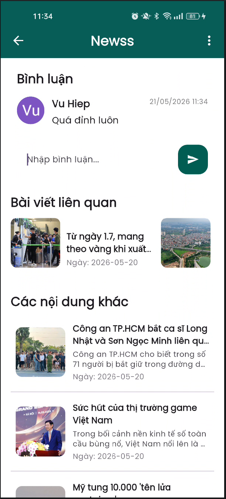</td>
      <td>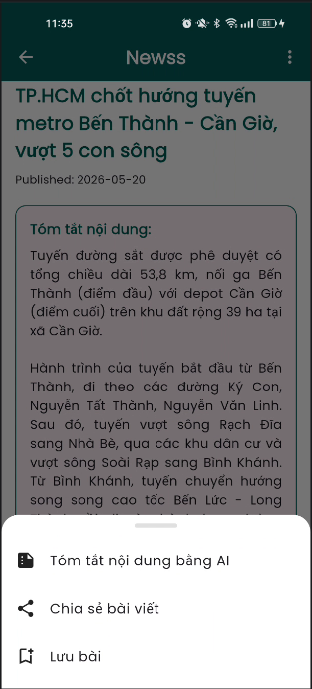</td>
    </tr>
  </table>
</div>

<p align="center">
  Nhóm chức năng quản trị viên
</p>

<div align="center">
  <table>
    <tr>
      <td>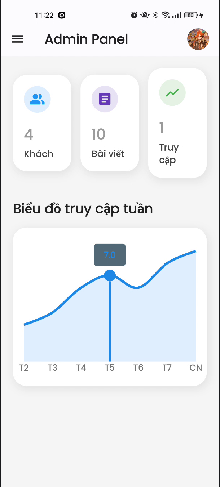</td>
      <td>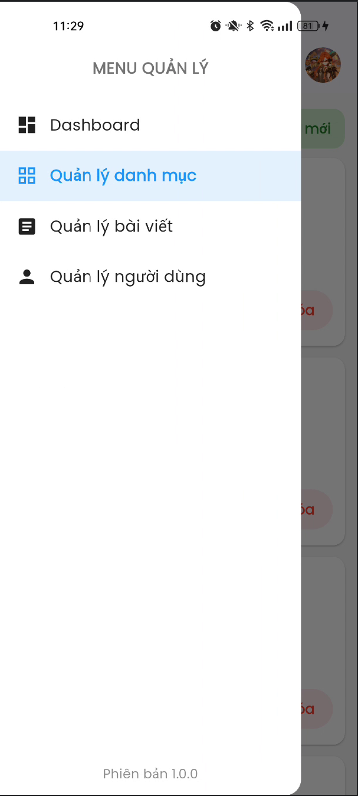</td>
      <td>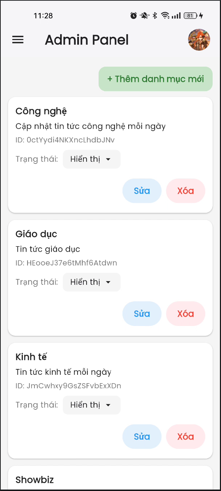</td>
      <td>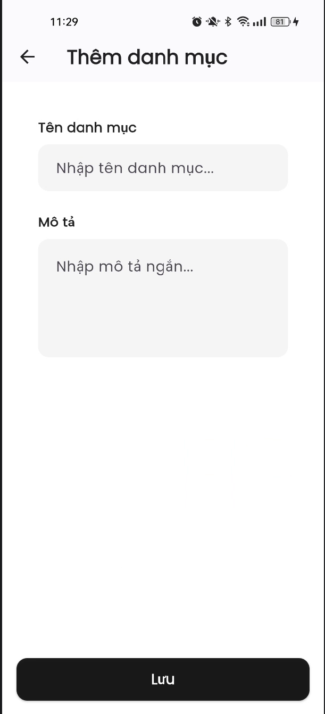</td>
    </tr>
    <tr>
      <td>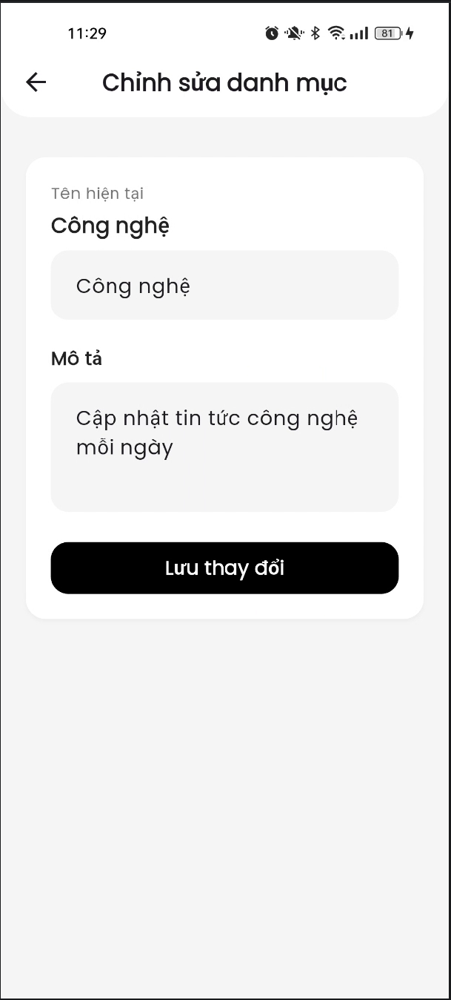</td>
      <td>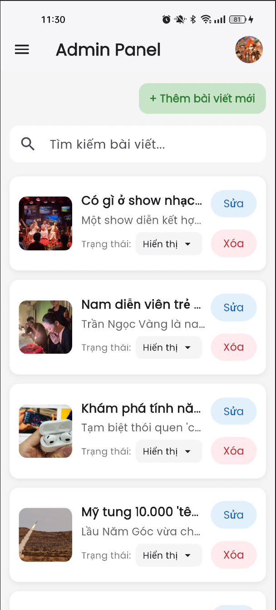</td>
      <td>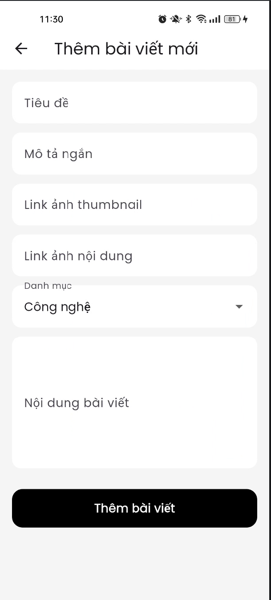</td>
      <td>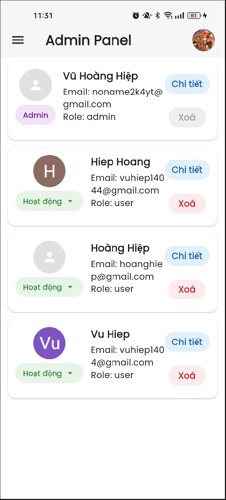</td>
    </tr>
  </table>
</div>

---

## 🧰 Công nghệ sử dụng

### Frontend
- Flutter: Framework phát triển ứng dụng đa nền tảng (Android, iOS)
- Dart: Ngôn ngữ lập trình chính của dự án
- Google Fonts: Tùy chỉnh font chữ
- Intl: Định dạng ngày giờ
- Share Plus: Chia sẻ bài viết qua các nền tảng khác

### Backend & Database
- Firebase Core: Kết nối và cấu hình các dịch vụ Firebase
- Firebase Authentication: Xác thực người dùng (Email, Google)
- Cloud Firestore: Cơ sở dữ liệu lưu trữ bài báo và thông tin người dùng
- Google Sign-In: Đăng nhập nhanh bằng tài khoản Google
- Flutter Dotenv: Quản lý biến môi trường và API Key

### Kiến trúc & AI
- Gemini API: Tóm tắt nội dung và gợi ý bài báo bằng AI
- FL Chart: Hiển thị biểu đồ thống kê cho Admin

---

## 📂 Cấu trúc dự án

```bash
lib/
├── core/
│   ├── theme/
│   │   ├── app_theme.dart
│   │   └── theme_viewmodel.dart
│   └── color.dart
│
├── features/
│   ├── admin/screens/
│   │   ├── add_article_page.dart
│   │   ├── add_category_page.dart
│   │   ├── admin_dashboard_screen.dart
│   │   ├── article_manager_page.dart
│   │   ├── category_manager_page.dart
│   │   ├── dashboard_page.dart
│   │   ├── edit_article_page.dart
│   │   ├── edit_categorypage.dart
│   │   ├── edit_user_screen.dart
│   │   ├── profile_screen.dart
│   │   ├── statistics_page.dart
│   │   └── user_manager_page.dart
│   │
│   ├── authentication/
│   │   ├── forgot_password_screen.dart
│   │   ├── login_screen.dart
│   │   └── register_screen.dart
│   │
│   ├── models/
│   │   ├── article_model.dart
│   │   ├── category_model.dart
│   │   ├── comment_model.dart
│   │   ├── podcast_model.dart
│   │   ├── reading_history_model.dart
│   │   └── user_model.dart
│   │
│   ├── viewmodel/
│   │   ├── ai_viewmodel.dart
│   │   ├── article_viewmodel.dart
│   │   ├── authen_viewmodel.dart
│   │   ├── category_viewmodel.dart
│   │   ├── comment_viewmodel.dart
│   │   ├── favorite_viewmodel.dart
│   │   ├── notification_viewmodel.dart
│   │   ├── podcastViewModel.dart
│   │   ├── reading_history_viewmodel.dart
│   │   ├── speech_viewmodel.dart
│   │   └── user_manager_viewmodel.dart
│   │
│   └── users/screens/
│       ├── article/
│       │   ├── article_detail_bottom_menu.dart
│       │   ├── article_detail.dart
│       │   ├── ramdom_article.dart
│       │   └── related_articles_widget.dart
│       │   
│       ├── category/
│       │   ├── articles_by_category_screen.dart
│       │   └── related_articles_widget
│       │   
│       ├── comment/
│       │   └── article_comments_widget.dart
│       │   
│       ├── history_reading/
│       │   └── reading_history_screen.dart
│       │   
│       ├── home/
│       │   ├── banner_article_.dart
│       │   ├── highlightBanner.dart
│       │   ├── home_screen.dart
│       │   └── latest_articles_screen.dart
│       │   
│       ├── intro/
│       │   └── splash_screen.dart
│       │   
│       ├── notification/
│       │   └── notification_screen.dart
│       │   
│       ├── profile/
│       │   ├── change_password_screen.dart
│       │   ├── edit_profile_screen.dart
│       │   ├── notification_settings_screen.dart
│       │   └── profile_tab.dart
│       │   
│       ├── saved/
│       │   └── saved_articles_screen.dart
│       │   
│       ├── search/
│       │   └── search_tab.dart
│       │   
│       └── setting/
│           └── setting_screen.dart   
│
├── firebase_options.dart
└── main.dart
```

---

## 🚀 Hướng dẫn chạy dự án

### Clone project
```bash
git clone https://github.com/Noname2k4/UDDNT_Nhom8
cd news
```

### Tạo file .env
```bash
GEMINI_API_KEY=your_api_key
```

### Thiết lập Firebase
- Tạo project Firebase
- Thêm Android/ios App
- Tải file google-services.json và GoogleService-Info.plist
- Đặt vào:
```bash
# android
android/app/

# ios
ios/Runner/
```

### Chạy ứng dụng

```bash
flutter pub get
flutter run
```

---

## 🔐 Hướng dẫn thiết lập API (Bảo mật khóa)

### 1. Tạo file .env
```bash
.env
```

### 2. Thêm API Key
```bash
GEMINI_API_KEY=your_api_key_here
```

---

## ⚠️ Hạn chế

- Chưa hỗ trợ offline hoàn toàn
- AI tóm tắt phụ thuộc API bên thứ ba
- Chưa tối ưu cho tablet
- Chưa hỗ trợ đa ngôn ngữ

## 📌 Hướng phát triển

- Hỗ trợ chế độ offline
- Tối ưu UI/UX
- Hỗ trợ đa ngôn ngữ
- Thêm chatbot AI

